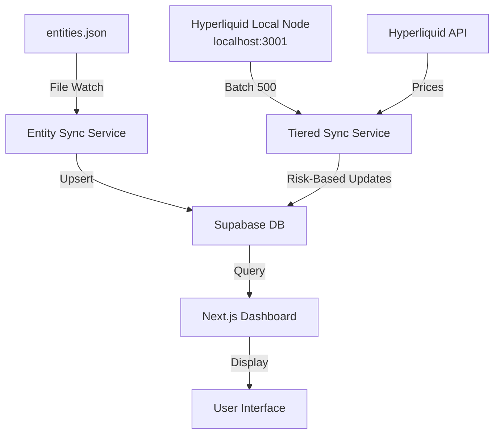

# Arkham Liquidation Monitor - Architecture

## 🏗️ System Architecture

### Overview
The system uses a **tiered monitoring strategy** to efficiently track liquidation risks for hundreds of positions while minimizing resource usage.

## 📊 Data Flow



## 🎯 Services

### 1. **Tiered Sync Service** (`tieredSyncService.ts`)
Main position monitoring service with intelligent update intervals:

| Risk Level | Liquidation Distance | Update Interval | Emoji |
|------------|---------------------|-----------------|-------|
| CRITICAL   | < 5%                | 10 seconds      | 🔴    |
| DANGER     | 5-10%               | 30 seconds      | 🟠    |
| WARNING    | 10-20%              | 1 minute        | 🟡    |
| SAFE       | > 20%               | 5 minutes       | 🟢    |

**Benefits:**
- 70% reduction in API calls
- 3x faster critical position detection
- Resource-efficient monitoring

### 2. **Entity Sync Service** (`entitySyncService.ts`)
Automatically syncs new entities from `entities.json`:
- **File watching**: Detects changes immediately
- **Periodic check**: Every 5 minutes as backup
- **Incremental sync**: Only adds/updates changed entities
- **No manual intervention needed**

### 3. **Legacy Background Sync** (Optional)
Original service that updates all positions every 30 seconds.
- Disabled by default when using tiered sync
- Can be enabled for simpler but less efficient monitoring

## 🚀 Deployment

### PM2 Process Management
```bash
# Start all services
pm2 start ecosystem.config.js

# Or start individually
pm2 start ecosystem.config.js --only arkham-tiered-sync
pm2 start ecosystem.config.js --only arkham-entity-sync

# View logs
pm2 logs arkham-tiered-sync
pm2 logs arkham-entity-sync

# Monitor
pm2 monit
```

### Service Dependencies
```
arkham-tiered-sync:
  - Depends on: Supabase (entities), Local Node, API
  - Memory: ~200-500MB
  - CPU: Low (spikes during batch updates)

arkham-entity-sync:
  - Depends on: entities.json file, Supabase
  - Memory: ~100-200MB
  - CPU: Minimal
```

## 🔧 Configuration

### Environment Variables
```env
# API Configuration
HYPERLIQUID_API_URL=http://localhost:3001/info

# Batch Processing
BATCH_SIZE_LOCAL=500     # For local node
BATCH_SIZE_REMOTE=10     # For remote API
BATCH_DELAY_LOCAL=5      # ms
BATCH_DELAY_REMOTE=100   # ms

# Database
NEXT_PUBLIC_SUPABASE_URL=your_url
NEXT_PUBLIC_SUPABASE_ANON_KEY=your_key
```

## 📈 Performance Optimization

### Local Node Advantages
- **Batch Size**: 500 addresses (vs 10 for remote)
- **Latency**: ~5ms (vs 100ms for remote)
- **Rate Limits**: None (vs strict limits on public API)
- **Reliability**: No network issues

### Tiered Strategy Benefits
```
Traditional (all 30s):
- 1000 positions × 2 req/min = 2000 req/min

Tiered:
- 50 critical × 6 req/min = 300 req/min
- 100 danger × 2 req/min = 200 req/min  
- 200 warning × 1 req/min = 200 req/min
- 650 safe × 0.2 req/min = 130 req/min
- Total: 830 req/min (58% reduction)
```

## 🗄️ Database Schema

### Entities Table
```sql
CREATE TABLE entities (
  address TEXT PRIMARY KEY,
  name TEXT NOT NULL,
  twitter TEXT,
  entity_type TEXT,
  collected_at TIMESTAMP,
  chain TEXT
);
```

### Positions Table
```sql
CREATE TABLE positions (
  id SERIAL PRIMARY KEY,
  address TEXT NOT NULL,
  coin TEXT NOT NULL,
  entry_price DECIMAL,
  position_size DECIMAL,
  leverage INTEGER,
  liquidation_price DECIMAL,
  unrealized_pnl DECIMAL,
  margin_used DECIMAL,
  position_value DECIMAL,
  last_updated TIMESTAMP DEFAULT NOW(),
  UNIQUE(address, coin)
);
```

### Liquidation Alerts Table
```sql
CREATE TABLE liquidation_alerts (
  id SERIAL PRIMARY KEY,
  position_id INTEGER REFERENCES positions(id),
  alert_type TEXT CHECK (alert_type IN ('warning', 'danger', 'critical')),
  distance_to_liquidation DECIMAL,
  current_price DECIMAL,
  created_at TIMESTAMP DEFAULT NOW()
);
```

## 🔍 Monitoring & Debugging

### Health Checks
```bash
# Check service status
pm2 status

# View recent logs
pm2 logs --lines 100

# Check specific service
pm2 describe arkham-tiered-sync
```

### Common Issues

**High Memory Usage**
- Check for memory leaks in position trackers
- Reduce batch sizes
- Restart service: `pm2 restart arkham-tiered-sync`

**Missed Updates**
- Check local node status
- Verify Supabase connection
- Review error logs: `pm2 logs --err`

**Entity Sync Not Working**
- Check file permissions on entities.json
- Verify file path is correct
- Manual trigger: `npx tsx scripts/uploadEntities.ts`

## 🔄 Future Improvements

1. **WebSocket Integration**: Real-time updates for critical positions
2. **Redis Cache**: Faster reads and reduced database load
3. **Alert System**: Email/Discord notifications for liquidations
4. **Historical Analysis**: Track liquidation patterns over time
5. **Multi-Chain Support**: Expand beyond Hyperliquid